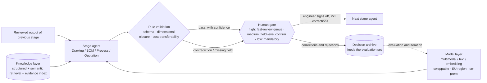
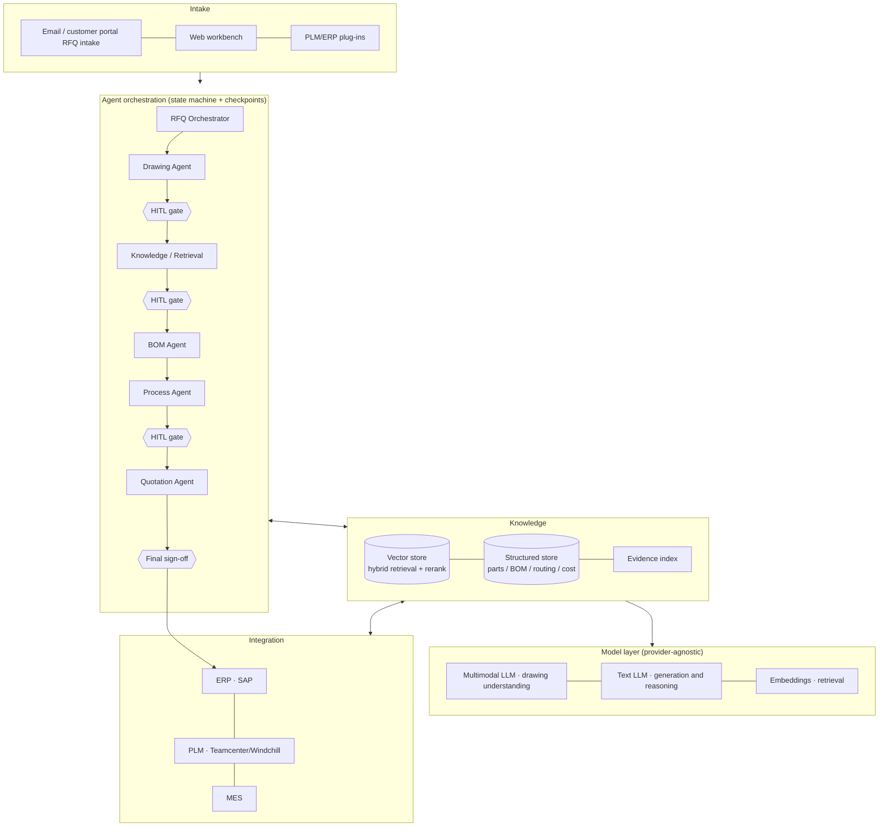

# PrecisionMotion GmbH — AI Engineering Platform: Solution Design

> IndustrialMind.ai Solution Design Challenge · Candidate: Ethan (Yi Sang)
> Working prototype: **QuoteMind** — an AI RFQ→Quotation pipeline.
> Code and setup: https://github.com/Ethan-YS/quotemind (demo mode runs the full flow with no API key or model configuration)
> Every claim marked *"implemented in the prototype"* can be run and verified in that repository.
> 中文版：[solution-design.zh.md](solution-design.zh.md)

---

## Executive Summary

Roughly half of PrecisionMotion's 150-engineer capacity goes into repetitive work, and **the RFQ→quotation chain alone consumes about 43 FTE**. It is the highest-volume, most standardised process, it has the most complete historical data, and it is the only one that moves cost and revenue at the same time. **This proposal therefore does not advance six agents in parallel — it breaks through on the quotation chain as the single main line, with the engineering knowledge base built underneath it as the foundation.**

**Pilot scope**: one product line (gearboxes) × one plant (Germany) × the RFQ→quotation chain, months 0–3. **Shadow mode first** — the AI runs blind against historical RFQs and is compared with what the engineers actually produced, so accuracy data earns trust before anything goes live.

**Target outcomes**: quotation lead time **5–10 days → 1–2 days**; pre-review recall on critical fields (material, tolerance, heat treatment, certificates) ≥99%; cost-estimate MAPE ≤12%; and **zero** quotations released without authorised sign-off.

**Three-year ROI**: base case ~€3.04M annual benefit (≈36 FTE of released capacity), ~€7.2M net over three years — **net ROI ≈ 379%, payback <12 months**; the conservative case still returns 228%. Revenue upside (faster response → higher win rate) is **deliberately excluded** from the ROI and left to be measured during the pilot. Benefits are framed as **capacity reallocation, not headcount reduction** — with an ageing engineering workforce that is both more honest and the precondition for getting the shop floor to cooperate.

**Why a working prototype is attached**: the central claim of any such proposal — *AI advises, humans decide* — is easy to write and hard to evidence. QuoteMind turns it into **three gates that will actually stop you** (feature-card material consistency, mandatory sign-off on low-confidence operations, and quotation-letter vs cost-sheet agreement), and archives every override, edit and approval the engineer makes onto the quotation itself. **It is not a demo; it is evidence for the trust claim.**

---

## Part 1 · Problem Analysis

### 1.1 Follow the hours: where does engineering time actually go?

PrecisionMotion's own numbers make the case (150 engineers, 1,600 productive hours per engineer-year):

| Workflow | Annual volume | Est. effort each* | Annual hours | FTE equivalent |
|---|---|---|---|---|
| RFQ handling (drawing review → BOM → routing → cost → quote) | 15,000 | 4.6 h avg | ~69,000 h | **~43** |
| Drawing review (new designs + changes) | 50,000 | 0.5–1 h | ~30,000 h | ~19 |
| Engineering changes (ECR impact analysis and propagation) | thousands | 2–4 h | ~9,000 h | ~6 |
| Looking for information (past drawings, routings, "ask the veteran") | 30–60 min per engineer per day | — | ~15,000 h | ~9 |

\* RFQ effort is modelled as 60% simple at 2 h / 30% medium at 6 h / 10% complex custom at 16 h → weighted 4.6 h. All assumptions are listed in Part 4.

Conclusion: **about half of engineering capacity is spent on repetitive, pattern-based work**, and the RFQ chain alone absorbs close to a third of the team.

### 1.2 The three business pains that hurt most

1. **Quoting is slow, expensive, and mostly wasted.** Custom parts typically take 5–10 working days to quote, while win rates run at 20–30% (**a planning assumption, to be validated against the customer's own history**) — meaning **70–80% of quoting effort produces no revenue at all**. Slow quoting also depresses the win rate itself, because buyers tend to award to the fastest qualified supplier. This is the one process bleeding from both the cost and the revenue side.
2. **Knowledge is locked inside senior engineers.** Design review depends on seniors, process decisions rest on experience, and comparable-part history is scattered across folders and mailboxes. The three plants (Germany, Poland, China) each accumulate their own and share none of it; when a senior engineer retires, the know-how evaporates. This is the defining structural risk in German manufacturing today — demographics plus the skilled-labour gap.
3. **Three plants with no single engineering source of truth.** The same part family can carry different BOM conventions, different routings and different cost structures per plant, and ECRs propagate across sites by hand. Scale ought to be an advantage; today it is friction.

### 1.3 Where AI returns the most

Ranked on four dimensions — volume × how pattern-based × data availability × direct revenue impact:

| Priority | Use case | Rationale |
|---|---|---|
| 🥇 | **RFQ→quotation chain** | Highest volume (15,000/yr), most standardised process, most complete history (past quotes + BOMs + routings + actual costs), and it drives both lead time and win rate — the only "cut cost *and* win more" engine |
| 🥈 | **Engineering knowledge base** | The foundation every other use case stands on; pays for itself on the 30–60 min/day search time alone |
| 🥉 | **Design review / DFM** | High value but the least tolerant of error — introduce it after trust is established |
| Later | Root-cause analysis, automated ECR propagation | Depend on MES/quality data being connected; park them for the platform phase |

**The main line of this proposal is therefore the RFQ→quotation chain, with the knowledge base built underneath it in parallel** — which is exactly the path the prototype demonstrates.

---

## Part 2 · Solution Design: the AI Engineering Platform

### 2.1 Six core agents

| Agent | What it does | Key inputs | Key outputs |
|---|---|---|---|
| **Drawing Intelligence** | Reads engineering drawings: title block, dimensions, tolerances, GD&T, material, surface and heat treatment | Drawing PDFs / scans / CAD exports | Structured "part feature card" (JSON) |
| **Engineering Knowledge** | Search and Q&A across company engineering knowledge: past drawings, BOMs, routings, ECRs, failure cases | PLM, file shares, mail archives | Answers with evidence links + comparable-part lists |
| **RFQ & Quotation** | Orchestrates the quotation chain: parse RFQ → find comparables → estimate BOM/routing → cost breakdown → quotation draft | Customer RFQ (mail/portal) + drawing | Quotation draft + cost breakdown + confidence labels |
| **BOM Generation** | Drafts the BOM from the feature card plus comparable-part history | Feature card, historical BOMs | BOM draft (incl. alternative-material suggestions) |
| **Process Planning** | Drafts the routing: operations, equipment, fixturing, cycle-time estimates | Feature card, BOM, per-plant capability profiles | Routing draft (per-plant variants) |
| **Design Review** | DFM/DFA checks, tolerance-vs-cost sanity flags, deltas against comparable parts | Feature card, design standards library | Review report (graded findings + evidence) |

Design principle: **agents share one knowledge layer rather than each building its own silo**, and every agent output carries evidence links — which historical drawing, which routing record supports this suggestion.

### 2.2 Data sources

- **PLM** (drawings, CAD, BOMs, ECRs) — the engineering source of truth
- **ERP** (material master, supplier prices, historical order costs) — the commercial source of truth
- **MES** (actual hours, yield, machine load) — the shop-floor source of truth, used to calibrate routing and cost estimates
- Historical quotations and win/loss records (cost calibration + win-rate analysis)
- The unstructured backlog: process documents, review minutes, RFQs buried in mailboxes, veterans' personal checklists

### 2.3 User workflow: a day in the life of a quotation engineer

**Before** (today, 5–10 days):
read the RFQ in mail → study the drawing manually → recall or dig for comparable parts → build the BOM by hand → chase a process colleague for the routing → cost it in Excel → write the quote → get approval → send

**After** (target, hours to 2 days):
1. The RFQ enters the platform and Drawing Intelligence produces a feature card — the engineer **verifies** instead of transcribing
2. The Knowledge Agent surfaces Top-N comparable parts with their BOMs, routings and actual costs — the engineer **selects and adjusts** instead of recalling
3. BOM, routing and cost drafts are produced stage by stage, and **each stage is reviewed by a human before the next one runs**
4. The quotation draft is generated in one step; the engineer gives final sign-off

**The engineer's role shifts from manual producer to reviewer and decision-maker — AI advises, it does not decide.**

### 2.4 Expected outputs

Part feature card · comparable-part comparison · BOM draft · per-plant routing draft · cost breakdown · quotation · design review report · knowledge Q&A with citations. Every output is structured, editable and traceable.

---

## Part 3 · Technical Architecture

### 3.1 Architecture

The real data flow through a single stage — **no agent output becomes the next stage's input without passing rule validation and a human gate**:

System view:

### 3.2 Model selection

- A **multimodal LLM** (drawings and documents), a **text LLM** (generation and reasoning) and an **embedding model** (retrieval), each used for what it is good at, and tiered by task difficulty — lightweight models for simple extraction, flagship models for hard reasoning — to keep cost under control.
- **A provider-agnostic abstraction layer**: Gemini / Claude / GPT / self-hosted open models are interchangeable. This is not architectural fastidiousness — engineering drawings are **intellectual property and trade secrets**, German customers are acutely sensitive about where they go, and "can be switched to an EU region or an on-prem open model" is a precondition for signing, so it has to be a first-class concern (governance detail in §3.6).
  *(Implemented in the prototype: one environment variable switches the same pipeline between Gemini API, Claude CLI and Codex CLI backends with zero change to business code.)*
- Drawing understanding does not rely on an end-to-end LLM alone: **vision extraction plus rule validation** — dimensional closure, title-block completeness, material-grade consistency.
  *(Implemented in the prototype: material-grade consistency is cross-checked across the extracted material field, the critical requirements and the feature specs; a contradiction blocks release.)*

### 3.3 Knowledge base

- **Hybrid retrieval**: dense embeddings + sparse retrieval (BM25/keyword) + reranking. Engineering text is dense with exact tokens — part numbers, material grades, standard references — and pure vector search will lose them.
- **Structure first**: filter on part features, material and tolerance ranges before semantic ranking. Engineering retrieval is *constraint satisfaction plus similarity*, not similarity alone.
  *(Implemented in the prototype: the structured channel scores deterministically, attaches a readable reason to every match, and marks parts of a different material class as "geometry reference only — cost does not transfer" — the classic estimating trap turned into an explicit output.)*
- **Evidence provenance**: every knowledge record keeps its source (which drawing, which routing, which ECR), and agent outputs must cite it.
- Cold-start strategy: load historical quotations and closed projects first — the most complete and self-validating data — rather than attempting everything at once.

### 3.4 Agent orchestration and human-in-the-loop

- Orchestration is an **explicit state machine** (LangGraph-style) rather than free-roaming agents: every stage has an input schema, an output schema and a checkpoint, so runs are replayable and auditable. Manufacturing customers want controllability, not magic.
- **Three-tier HITL** — confidence determines the *intensity* of review, never whether review happens:
  - High confidence → fast-review / batch-confirm queue (**not** automatic release)
  - Medium confidence → field-level confirmation before the next stage runs
  - Low confidence or detected contradiction → mandatory human handling; the AI presents evidence and withholds a conclusion
  - **In every tier, outbound quotations and released BOMs and routings always require sign-off by an authorised person** — confidence modulates workload, not authority.
- Every human correction is captured as a **versioned evaluation case and a training candidate**; only approved, anonymised data ever enters model training. **There is no online self-learning** — an engineer's edit does not silently change model behaviour, and customer engineering data does not become training material by default just because the system was used. In German manufacturing this is a contractual precondition, not an option.
- **"The system gets better with use"** therefore means: a growing evaluation set, a growing rule base, and controlled data iteration — all three human-reviewed, versioned, reversible and auditable.
- In one line: **AI advises, humans decide; the judgement stays with the engineer.**

**In the prototype these are enforced rules, not stated intentions.** QuoteMind implements three gates, and failing any of them blocks release:

| Gate | Trigger | What the engineer does | Which principle it enforces |
|---|---|---|---|
| Feature-card consistency | The material field and a critical requirement or feature spec name different grades | Correct the lines, or declare the difference deliberate (mating part, coating) | Contradiction → mandatory intervention |
| Low-confidence sign-off | Operations the model itself rated `confidence: low` | Confirm each one, or delete the operation | Low confidence → mandatory intervention |
| Quotation-letter agreement | Prices in the letter disagree with the cost sheet | Sync in one click, or edit the letter | Humans decide, but the system catches them |

The third gate does not guard against AI hallucination — it guards against **human oversight**. An engineer changes the margin and forgets the letter; the AI would never make that mistake, a person will. Real human-AI collaboration runs in both directions.

### 3.5 3D CAD: cross-checking the 2D drawings (from Phase 2)

The customer produces 30,000 CAD models a year against 50,000 drawings — **two representations of the same parts**. Working only in 2D leaves half the source of truth unused. 2D comes first because the quotation chain's real input *is* the drawing (customers attach PDFs to RFQs), but the CAD channel has to follow in Phase 2:

- **Geometric feature extraction**: parse B-Rep from STEP / JT / native CAD to derive volume, mass, envelope, holes, slots and manufacturable features automatically. Engineers estimate these by eye today, and that is the dominant error source in stock-size and cycle-time estimates.
- **2D↔3D cross-validation**: flag where drawing annotation and model geometry disagree. This is one of the most expensive classes of manufacturing error, and **only a system looking at both at once can catch it** — a person reading two documents in two sittings structurally cannot.
- **CAD-based comparable search**: geometric similarity complements feature similarity, and enables cross-plant geometry deduplication (the same part modelled three times at three plants is real, measurable waste).
- Positioning: **the CAD channel buys estimation accuracy; the 2D channel buys response speed.** Speed first, then accuracy — not the other way round.

### 3.6 Security, permissions and data governance

In a German industrial procurement questionnaire this section carries no less weight than functionality:

| Concern | Approach |
|---|---|
| Permission inheritance | **Do not build a second permission system.** Inherit existing PLM/ERP project and role authorisation; AI results are filtered by the caller's permissions, so retrieval never becomes a privilege-escalation path |
| Cross-plant visibility | Germany / Poland / China segregated by part family and project; **cross-plant reuse defaults to anonymised process parameters rather than source drawings**, and moving source drawings across borders requires explicit authorisation and leaves a record |
| Identity and access | Enterprise SSO (SAML/OIDC) + RBAC, with immediate revocation driven by the HR system |
| Encryption | TLS 1.3 in transit, encryption at rest; model artefacts are treated with the same care as drawings |
| Deployment and data residency | EU-region hosting or on-prem open models; **"customer data never leaves the customer boundary" is an available deployment shape**, not merely a promise |
| Training isolation | Customer data is excluded from training by default; inclusion requires separate written authorisation, anonymisation and version records (see §3.4) |
| Retention and deletion | Configurable retention, per-project and per-customer deletion requests honoured across the vector store and caches |
| Audit | Every AI suggestion, every human correction and every sign-off is logged with the model version — so that when a quotation is disputed, the answer to *"who approved this, on what basis, with which model version"* exists |

> A terminology note that matters: engineering drawings are primarily an **intellectual-property and trade-secret** concern, governed by confidentiality and export-control practice. **GDPR applies only where personal data is present** — an engineer's name in a title block or an approval record. The controls differ, and conflating the two signals to a customer's legal team that the supplier has not done this before.

### 3.7 System integration

- ERP (SAP, most likely, for a German manufacturer), PLM and MES are integrated **read-first, write-cautiously**: read master data and history freely; write back only after human confirmation (archiving a released quotation, pushing a BOM draft into the PLM's formal approval flow).
- Integration is staged: Phase 1 runs the pilot on file/export exchange, so **the project is not held hostage by the IT integration backlog**; API-level integration lands from Phase 2.

---

## Part 4 · Business Case (3-year ROI)

### 4.1 Assumptions (all of them, stated)

| # | Assumption | Value | Basis |
|---|---|---|---|
| A1 | Fully loaded engineer cost (Germany/Poland/China blended) | €85k per year | Germany €110k+ / Poland ~€55k / China ~€45k, weighted |
| A2 | Productive hours per engineer-year | 1,600 h | Industry convention |
| A3 | Average engineering effort per RFQ | 4.6 h (60% simple 2 h / 30% medium 6 h / 10% complex 16 h) | Conservative |
| A4 | AI efficiency gain on the RFQ chain | conservative 40% / base 55% / optimistic 65% | To be calibrated by pilot measurement |
| A5 | Information-search time | 45 min per engineer per day, halved by AI | Standard knowledge-management benchmark |
| A6 | Platform total cost of ownership | ~€1.9M over 3 years (year 1 incl. implementation €0.9M, then €0.5M/yr) | Subscription, implementation, integration and internal change effort |

### 4.2 Benefits (base case)

| Benefit stream | Calculation | Annualised |
|---|---|---|
| RFQ chain efficiency | 69,000 h × 55% × (€85k / 1,600 h) | **€2.0M** |
| Information-search efficiency | 15,000 h × 50% × hourly rate | €0.4M |
| Drawing review / ECR efficiency (30%, conservative) | 39,000 h × 30% × hourly rate | €0.6M |
| **Annual total** | | **~€3.04M** |

**Three years, base case: ~€9.1M benefit against ~€1.9M cost → ~€7.2M net.**
Stated precisely to avoid ambiguity: **net ROI = (benefit − cost) / cost ≈ 379%**; **benefit-to-cost ratio ≈ 4.8×**; **payback < 12 months**.

The conservative case, derived the same way (hourly rate €53.12 = €85k ÷ 1,600 h):

| Benefit stream | Conservative assumption | Annualised |
|---|---|---|
| RFQ chain efficiency | 69,000 h × **40%** | €1.47M |
| Information-search efficiency | 15,000 h × **25%** (half the base case) | €0.20M |
| Drawing review / ECR | 39,000 h × **20%** | €0.41M |
| **Annual total** | | **€2.08M** |

**Conservative case: ~€6.2M over three years against ~€1.9M cost → net ROI ≈ 228% (benefit-to-cost ≈ 3.3×). The case holds even here.**

> No double counting: the 69,000 h in the RFQ chain already includes drawing review performed *for quoting*. The separate 30,000 h "drawing review" line covers new-design and engineering-change drawings that **do not pass through the quotation process**. The two are mutually exclusive.

### 4.3 Lead time and revenue upside (**explicitly excluded from the ROI**)

- Quotation lead time: **5–10 days → 1–2 days** (same-day for simple parts).
- Response speed is a known strong driver of win rate, but **this proposal does not put a number on it.** Win rate applies to *annual quoted value*, and that base — along with the current baseline win rate, the response-time elasticity and the available production capacity — has to be measured from the customer's own data. Any revenue figure produced before those are known is not credible.
- Therefore: **the ROI table uses cost savings only, and revenue upside is quantified during the pilot** — annual quoted value × baseline win rate × response-time elasticity, capped by available capacity. The ROI is designed to stand on the hardest possible basis; that is deliberate.

### 4.4 How to talk about headcount (this matters in Germany)

**Frame it as capacity reallocation, not redundancy.** The base case's €3.04M annualised benefit corresponds to roughly **36 FTE of released capacity** (RFQ chain ~24 · knowledge search ~5 · drawing and ECR ~7), redirected into new product development, customer-specific projects and process improvement — the work that everyone wants to do and nobody currently has time for. Against a backdrop of an ageing engineering workforce and a skilled-labour shortage, "use AI to amplify the team you have" is both more truthful than "use AI to replace them" and far more likely to earn the cooperation of the engineers themselves — and adoption is a precondition for the ROI, not a detail.

---

## Part 5 · Roadmap

### Phase 1 (months 0–3) · Pilot and trust-building

- Scope: **one product line (gearboxes) × one plant (Germany) × the RFQ→quotation chain**
- Actions: load 2–3 years of that product line's history (quotations, BOMs, routings, actual costs); **run shadow mode first** — the AI works historical RFQs blind and is compared against what the engineers actually produced, so the accuracy data makes the case before go-live
- Exit gates — **critical fields and ordinary fields are measured separately**, because one error in a critical field costs far more than one in an ordinary field:

| Metric | Target | Why this one |
|---|---|---|
| Critical-field recall (material / tolerance / heat treatment / certificates) | ≥ 99% (before human review) | An error here means the wrong price or the wrong part |
| Ordinary-field extraction accuracy | ≥ 95% (before human review) | Affects efficiency, not correctness |
| Comparable-part Top-5 hit rate | ≥ 80% | Quality of the cost-calibration basis |
| Cost-estimate MAPE (against actual cost of won orders) | ≤ 12% | The ultimate test of quotation credibility |
| Quotation lead-time reduction | ≥ 50% | The most visible business outcome |
| Human edit rate (share of AI drafts changed) | Declining month over month | Whether the system is genuinely improving |
| **Quotations released without authorised sign-off** | **Must be 0** | A control, not an efficiency metric — a single occurrence pauses the rollout |

- In parallel: data assessment and knowledge-base foundations, to clear the path for Phase 2

### Phase 2 (months 3–9) · Departmental rollout

- Extend the RFQ chain to all product lines and to both the German and Polish plants; the BOM Agent and Process Planning Agent go into production
- Open the knowledge base to all engineers (Engineering Knowledge Agent)
- Replace Phase 1's file exchange with API-level ERP/PLM integration
- Add the 3D CAD channel (§3.5): geometric feature extraction and 2D↔3D cross-validation
- Establish AI usage policy and audit process — who approved what, on what basis

### Phase 3 (months 9–24) · Enterprise AI engineering platform

- Design Review Agent and ECR impact analysis go live; the China plant is connected
- Cross-plant know-how reuse: routing comparison across the three plants, migration of best practice
- Platform maturity: permission model, multi-language (DE/EN/PL/ZH), continuous model evaluation and iteration loop
- From tool to infrastructure: a new engineer's first day already happens inside an AI-assisted workflow

### Risks and mitigations

| Risk | Mitigation |
|---|---|
| Historical data is dirty or scattered | Phase 1 targets the product line with the most complete data; data cleansing is part of implementation, not handed back to the customer |
| Engineer resistance or distrust | Shadow mode lets data make the argument; HITL keeps judgement with people; senior engineers are engaged as "AI coaches" rather than being displaced |
| Drawing understanding misses accuracy targets | Confidence tiers plus rule validation as a backstop; categories that fail the gate revert to fully manual rather than being forced through |
| Data residency and trade secrets | EU-region / on-prem deployment options; drawings never leave the customer boundary; training isolation and audit trails (see §3.6) |
| **Model drift / version changes** | Model versions are bound to evaluation sets and regression-tested before upgrade; quotation records carry the model version, so decisions can be rolled back and accounted for |
| **Historical cost is not always transferable** | A change of material grade, routing or production line invalidates historical cost; the system marks such matches "geometry reference only" and lets the engineer overrule a reference part outright (implemented in the prototype) |
| IT integration slips | Phase 1 proves value on file exchange, decoupling integration from value validation |

---

## Appendix · Prototype scope (QuoteMind)

The prototype implements the main line end to end, with five operations mapping onto the quotation chain in this proposal: **sample RFQ + engineering drawing → feature-card extraction (vision LLM) → comparable-part retrieval (structured feature matching, i.e. the structured channel of hybrid retrieval) → BOM and routing drafts → cost breakdown and quotation letter**.

Every operation is a human review gate, and the engineer can do considerably **more than edit numbers**:

| Operation | What the engineer can do | Which design claim it evidences |
|---|---|---|
| OP 20 Drawing Review | Correct any extracted value; the system checks material-grade consistency and blocks contradictions | §3.3 structure first · §3.4 contradiction → mandatory intervention |
| OP 30 Similar Parts | **Overrule** the algorithm's chosen reference parts (with a stated reason); excluded parts never reach cost calibration | §3.3 domain knowledge beats similarity scoring |
| OP 40 BOM & Routing | Add or remove BOM lines and operations, watch cost and machine time recalculate live, sign off each low-confidence operation | §3.4 three-tier HITL · §2.3 producer → reviewer |
| OP 50 Quotation | Price two ways (margin ⇄ price), add assumptions and risks, hard block on letter/cost-sheet disagreement | §2.4 outputs are editable and traceable |

Every override, addition, deletion, sign-off and correction lands in the **"Engineer decisions" archive on OP 50** and travels with the quotation — the seed of §3.4's "human corrections feed the evaluation set".

**Honest boundaries.** Comparable-part retrieval is deterministic code and runs for real in every mode. The four LLM stages replay a cached snapshot of a real model run in demo mode, and the interface says so on those stages ("the replayed answer does not recompute from your corrections"); switching to a live backend (Gemini / Claude CLI / Codex CLI) shows corrections propagating end to end. The parts library is 13 hand-built demonstration records; rates and assumptions are hard-coded in the prompts, where a production system would read them from ERP master data.
