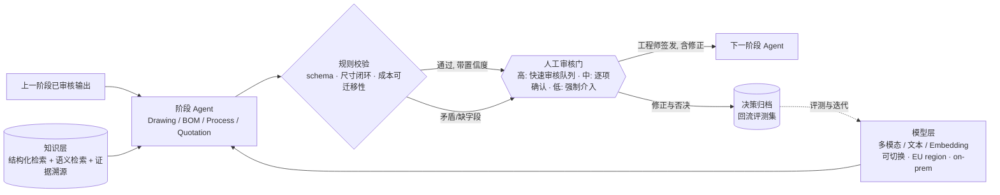
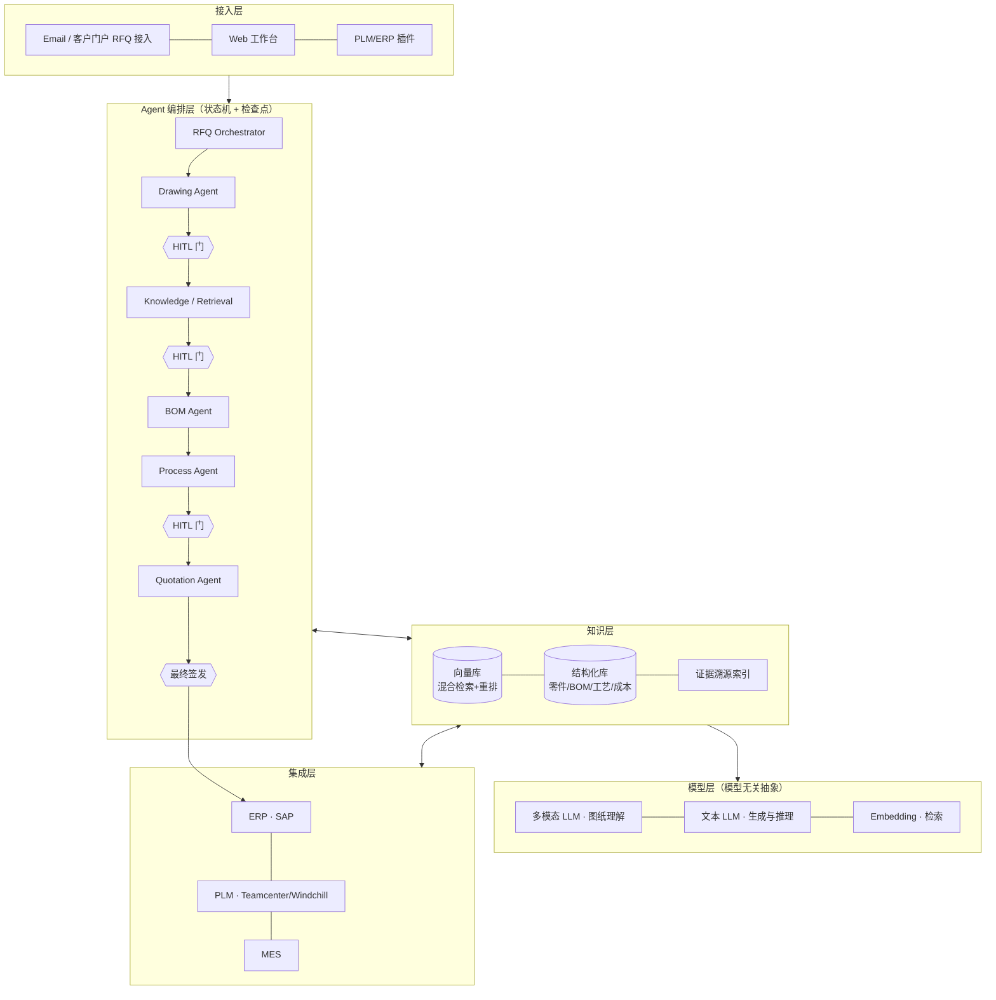

# PrecisionMotion GmbH · AI 工程平台方案设计

> IndustrialMind.ai Solution Design Challenge · 候选人：Ethan (Yi Sang)
> 配套原型：**QuoteMind** —— AI RFQ→Quotation 流水线，可运行代码与说明见
> https://github.com/Ethan-YS/quotemind（demo 模式无需 API key 或模型配置即可跑通全流程）
> 文中凡标注"原型已实现"处，均可在该仓库中运行验证。
> English: [solution-design.md](solution-design.md)

---

## 执行摘要

PrecisionMotion 的 150 名工程师中，约有一半产能消耗在重复性工作上，其中 **RFQ→报价链一项就吃掉约 43 个 FTE**——量最大、流程最标准、历史数据最全，且是唯一同时影响成本与营收的环节。**因此本方案不做"六个 Agent 齐头并进"，而是把报价链作为主线单点突破，工程知识库作为地基同步建设。**

**试点范围**：单一产品线（齿轮箱）× 单一厂区（德国）× RFQ→报价链，0–3 个月。先 **Shadow mode** 用历史 RFQ 盲测，以准确率数据换取工程师信任，再上线。

**目标结果**：报价周期 **5~10 天 → 1~2 天**；关键字段（材料/公差/热处理/证书）人审前召回率 ≥99%；成本估算 MAPE ≤12%；未经授权签发的对外报价数必须为 0。

**三年 ROI**：基准档年化收益 ~€3.04M（≈36 FTE 等效产能），三年净收益 ~€7.2M，**净 ROI ≈ 379%，回本 <12 个月**；保守档净 ROI 仍有 228%。营收上行（响应速度→中标率）**刻意排除在 ROI 之外**，留待试点期用客户自己的报价数据量化。收益**按产能重配讲，不按裁员讲**——在工程师老龄化背景下，这既更真实，也是拿到一线配合的前提。

**为什么附一个可运行原型（QuoteMind）**：方案里最关键的主张——"AI 给建议、人做判断"——写在文档上人人都会写。原型把它变成**三道会真正拦住你的闸门**（特征卡材料自洽、低置信工序强制签核、报价信与成本表一致性），并把工程师对 AI 的每一次否决、增删与修正归档到报价单上。**这不是 demo，是对可信度主张的举证。**

---

## Part 1 · 问题分析

### 1.1 先算账：工程师的时间花在哪

PrecisionMotion 的数字自己会说话（150 名工程师，按人均年有效工时 1,600h 计）：

| 工作流 | 年度量 | 单件估耗* | 年耗工时 | 折合 FTE |
|---|---|---|---|---|
| RFQ 处理（审图→BOM→工艺→成本→报价） | 15,000 | 平均 4.6h | ~69,000h | **~43** |
| 图纸审查（新图+变更图） | 50,000 | 0.5~1h | ~30,000h | ~19 |
| 工程变更（ECR 影响分析与传播） | 数千 | 2~4h | ~9,000h | ~6 |
| 找信息（历史图纸/工艺/"问老师傅"） | 每人每天 30~60min | — | ~15,000h | ~9 |

\* RFQ 单件估耗按结构假设：60% 简单件 2h / 30% 中等 6h / 10% 复杂定制 16h，加权 4.6h。所有假设见 Part 4。

结论：**约一半的工程产能花在重复性、模式化的工作上**，其中 RFQ 链条一项就吃掉近 1/3 的团队。

### 1.2 三个最疼的业务痛点

1. **报价既慢又贵，还大多打了水漂。** 定制件报价周期通常 5~10 个工作日；而中标率按行业经验取 20~30%（**规划假设，待客户历史数据验证**），意味着 **70~80% 的报价工程投入不产生任何收入**。报价慢本身还压低中标率——客户往往把订单给响应最快的合格供应商。这是"成本"与"营收"两头同时失血的环节。
2. **知识锁在资深工程师脑子里。** 设计评审依赖 senior、工艺决策靠经验、相似件历史散落在文件夹和邮件里。三个厂区（德/波/中）各自积累、互不流通；资深工程师退休或离职，know-how 直接蒸发。这是德国制造业当前最普遍的结构性风险（人口结构 + 技工缺口）。
3. **三厂协同没有统一的工程事实源。** 同一零件族在不同厂区可能有不同 BOM 习惯、不同工艺路线、不同成本结构；ECR 的跨厂传播靠人肉。规模本应是优势，现在是摩擦。

### 1.3 AI 的 ROI 在哪里最高

按"量大 × 模式化 × 数据可得 × 直接影响营收"四个维度排序：

| 优先级 | 场景 | 判断 |
|---|---|---|
| 🥇 | **RFQ→报价链** | 量最大（15,000/年）、流程最标准、历史数据最全（历史报价+BOM+工艺+实际成本），且直接影响 lead time 和中标率——唯一"降本+增收"双引擎的场景 |
| 🥈 | **工程知识库** | 所有其他场景的地基；单独也有回报（每人每天找信息的 30~60min） |
| 🥉 | **设计评审 / DFM** | 价值高但对准确率要求最苛刻，适合在信任建立后上 |
| 后置 | 根因分析、ECR 自动传播 | 依赖 MES/质量数据打通，放平台期 |

**因此本方案的主线是 RFQ→报价链，知识库作为地基同步建设**——这也是原型所演示的链路。

---

## Part 2 · 方案设计：AI Engineering Platform

### 2.1 六个核心 Agent

| Agent | 做什么 | 关键输入 | 关键输出 |
|---|---|---|---|
| **Drawing Intelligence** | 读懂工程图纸：标题栏、尺寸、公差、GD&T、材料、表面处理、热处理要求 | 图纸 PDF/扫描件/CAD 导出 | 结构化"零件特征卡"（JSON） |
| **Engineering Knowledge** | 全公司工程知识的检索与问答：历史图纸、BOM、工艺、ECR、失效案例 | PLM/文件系统/邮件归档 | 带证据溯源的答案 + 相似件列表 |
| **RFQ & Quotation** | 编排整条报价流水线：解析 RFQ→找相似件→估 BOM/工艺→成本分解→报价书草稿 | 客户 RFQ（邮件/门户）+ 图纸 | 报价书草稿 + 成本分解 + 置信度标注 |
| **BOM Generation** | 基于特征卡 + 相似件历史生成 BOM 草稿 | 特征卡、历史 BOM | BOM 草稿（含替代料建议） |
| **Process Planning** | 生成工艺路线草稿：工序、设备、装夹、节拍估算 | 特征卡、BOM、各厂设备能力档案 | Routing 草稿（分厂区版本） |
| **Design Review** | DFM/DFA 检查、公差-成本合理性提示、与相似件的差异对比 | 特征卡、设计规范库 | 评审报告（问题分级 + 依据） |

设计原则：**Agent 之间共享同一个知识层，而不是各建各的数据孤岛**；每个 Agent 的输出都带证据链接（哪张历史图、哪条工艺记录支持了这个建议）。

### 2.2 数据源

- **PLM**（图纸、CAD、BOM、ECR）——工程事实源
- **ERP**（物料主数据、供应商价格、历史订单成本）——商业事实源
- **MES**（实际工时、良率、设备负荷）——现场事实源，用于校准工艺与成本估算
- 历史报价单与中标记录（估价校准 + 中标率分析）
- 非结构化存量：工艺文件、评审纪要、邮件里的 RFQ、老师傅的检查清单

### 2.3 用户工作流：报价工程师的一天（Before / After)

**Before**（今天，5~10 天）：
读邮件收 RFQ → 人工看图 → 凭记忆/翻文件夹找相似件 → 手建 BOM → 找工艺同事排 routing → Excel 算成本 → 写报价 → 审批 → 发出

**After**（目标，数小时~2 天）：
1. RFQ 进入平台，Drawing Intelligence 自动出"零件特征卡"——工程师**核对**而不是抄录
2. Knowledge Agent 给出 Top-N 相似件（附历史 BOM/工艺/实际成本）——工程师**选择与调整**而不是回忆
3. BOM / Routing / 成本草稿逐级生成，每一级都是**人审后再进下一级**
4. 报价书草稿一键生成，工程师终审签发

**工程师角色从"手工生产者"变成"审核者与决策者"——AI 给建议，不做判断。**

### 2.4 预期输出物

零件特征卡 · 相似件对比报告 · BOM 草稿 · 分厂区工艺路线草稿 · 成本分解表 · 报价书 · 设计评审报告 · 知识问答（带引用）。所有输出物：结构化、可编辑、可追溯。

---

## Part 3 · 技术架构

### 3.1 分层架构

单个阶段的真实数据流——**每个 Agent 的产出都必须穿过规则校验和人工门，才能成为下一阶段的输入**：

系统全景：

### 3.2 模型选型

- **多模态 LLM**（图纸/文档理解）+ **文本 LLM**（生成、推理）+ **Embedding 模型**（检索）分工使用，按任务难度分档调用（简单抽取用轻量模型，复杂推理用旗舰模型）控制成本。
- **模型无关抽象层**：Gemini / Claude / GPT / 开源本地模型可切换。这不是技术洁癖——工程图纸是**知识产权与商业秘密**，德国客户对其去向极度敏感，"可切换到 EU region 或 on-prem 开源模型部署"是签单的前提条件，必须是架构的一等公民（治理细节见 §3.6）。
  *（原型已实现：同一条流水线通过一个环境变量在 Gemini API / Claude CLI / Codex CLI 三种后端间切换，业务代码零改动。）*
- 图纸理解不迷信端到端 LLM：**vision LLM 抽取 + 规则校验** 双保险——尺寸闭环检查、标题栏字段完整性、材料牌号自洽性。
  *（原型已实现其中的材料牌号自洽校验：抽取值与关键要求、特征规格三处交叉比对，检出矛盾即拦截放行。）*

### 3.3 知识库

- **混合检索**：dense embedding + 稀疏检索（BM25/关键词）+ 重排（rerank），工程语料里型号/牌号/标准号这类精确 token 极多，纯向量检索必吃亏。
- **结构化优先**：零件特征、材料、公差范围先走结构化过滤，再做语义排序——工程检索是"约束满足 + 相似度"，不是纯语义。
  *（原型已实现结构化通道：确定性打分、每条匹配附可读理由、材料等级不同者标为"仅几何参考、成本不可迁移"——报价估算最经典的坑被变成显式输出。）*
- **证据溯源**：每条知识记录来源（哪张图/哪份工艺/哪个 ECR），Agent 输出必须引用。
- 冷启动策略：先灌历史报价 + 已完结项目（数据最全、最闭环），不追求一次性全量。

### 3.4 Agent 编排与 HITL

- 编排用**显式状态机**（LangGraph 风格）而非自由 agent 漫游：每个阶段有输入 schema、输出 schema、检查点，可回放、可审计——制造业客户要的是可控性，不是魔法。
- **HITL 三分法**（按置信度决定审核的**强度**，而不是要不要审核）：
  - 高置信 → 进入快速审核 / 批量确认队列（不是自动放行）
  - 中置信 → 字段级人工逐项确认后方可进入下一阶段
  - 低置信 / 检出矛盾 → 强制人工处理，AI 只列证据不给结论
  - **无论哪一档，对外报价、正式 BOM 与工艺发布，始终需要授权人员签发**——置信度调节的是工作量，不是授权。
- 人的每次修正都被记录，**形成带版本的评测用例与候选训练数据**；只有经审批、脱敏后的数据才可进入模型训练。**不做在线自动学习**——工程师的修改不会自动改变模型行为，客户的工程数据也不会因为"用了系统"就默认成为训练语料。这在德国制造业是合同前提，不是可选项。
- **系统随使用变准**的机制是：评测集扩充 → 规则库补充 → 受控的数据迭代，三者都有人审与版本，可回滚、可审计。
- 原则一句话：**AI 给建议，人做判断；判断权始终在工程师手里。**

**这三条在原型里是被执行的规则，不是写在文档上的承诺**——配套原型 QuoteMind 实现了三道闸门，任一不满足就无法放行：

| 闸门 | 触发条件 | 人的动作 | 对应上面哪一条 |
|---|---|---|---|
| 特征卡自洽 | 主材料与关键要求/特征规格中的牌号不一致 | 修正条目，或声明"该差异是有意的"（配对件、镀层） | 检出矛盾 → 强制介入 |
| 低置信工序签核 | 模型自评 `confidence: low` 的工序 | 逐条确认，或删除该工序 | 低置信 → 强制介入 |
| 报价信一致性 | 报价信中的价格与成本表不符 | 一键同步，或手改报价信 | 判断权在人，但系统替人兜底 |

第三道闸门防的不是 AI 的幻觉，是**人自己的疏漏**——工程师改了毛利忘了改信，这类错误 AI 不会犯，人才会。真正的人机协作是双向的。

### 3.5 3D CAD：与二维图纸互为校验（Phase 2 起）

客户每年 30,000 个 CAD 模型，与 50,000 张图纸是**同一批零件的两种表达**——只做二维等于放着一半的事实源不用。二维先行是因为报价链的输入现实中就是图纸（客户 RFQ 附的是 PDF），但 CAD 通道必须在 Phase 2 补上：

- **几何特征抽取**：STEP / JT / 原生 CAD 解析 B-Rep，自动得出体积、质量、包络、孔槽与可制造特征——这些量今天靠工程师目测估算，是 BOM 毛坯与工时估算误差的主要来源。
- **2D↔3D 交叉校验**：图纸标注与模型几何不一致时告警。这是制造业最贵的错误之一，且**只有系统同时看两者才可能发现**——人分两次看两份文件，天然发现不了。
- **CAD 相似件检索**：几何相似度补足特征相似度，并做跨厂几何去重（同一零件在三厂重复建模是真实存在的浪费）。
- 价值定位：**CAD 通道提升的是估算精度，二维通道提升的是响应速度**——先要速度，再要精度，顺序不能反。

### 3.6 安全、权限与数据治理

德国工业客户的采购问卷里，这一节的权重不低于功能：

| 关注点 | 方案 |
|---|---|
| 权限继承 | **不新建一套权限体系**，继承 PLM/ERP 既有的项目与角色授权；AI 检索结果按调用者权限过滤，检索不得成为越权通道 |
| 跨厂可见性 | 德/波/中三厂按零件族与项目分域隔离；**跨厂知识复用默认走"脱敏工艺参数"而非原图**，原图跨境需显式授权并留痕 |
| 身份与访问 | 企业 SSO（SAML/OIDC）+ RBAC，与 HR 系统联动的离职即时回收 |
| 加密 | 传输 TLS 1.3、静态加密；图纸与模型产物同等对待 |
| 部署与数据主权 | EU region 托管或 on-prem 开源模型；**客户数据不出客户边界**是可选的部署形态，不是承诺 |
| 训练隔离 | 客户数据默认不进训练；进训练需单独书面授权 + 脱敏 + 版本记录（见 §3.4） |
| 留存与删除 | 可配置留存期，支持按项目/客户的删除请求，删除覆盖向量库与缓存 |
| 审计 | 每次 AI 建议、每次人工修正、每次签发全量留痕，含模型版本号——**报价争议时能回答"当时是谁、依据什么、用哪个模型版本批的"** |

> 术语上不要混：工程图纸的核心是**知识产权与商业秘密**，适用保密与出口管制口径；**GDPR 仅在数据含个人信息时适用**（如工程师姓名出现在图纸签署栏、审批记录中）。两者的控制手段不同，混为一谈会让客户的法务觉得供应商不专业。

### 3.7 系统集成

- ERP（德企大概率 SAP）/ PLM / MES 走**读为主、写审慎**：读取主数据与历史，写回只在人工确认后（如报价书归档、BOM 草稿推入 PLM 走正式审批流）。
- 集成分级落地：Phase 1 用文件/导出对接即可跑通试点，**不把项目卡死在 IT 集成排期上**；Phase 2 起上 API 级集成。

---

## Part 4 · 商业测算（3 年 ROI）

### 4.1 假设（全部摊开）

| # | 假设 | 取值 | 依据 |
|---|---|---|---|
| A1 | 工程师全成本（德/波/中混合） | €85k/人年 | 德国 €110k+ / 波兰 ~€55k / 中国 ~€45k 加权 |
| A2 | 人均年有效工时 | 1,600h | 行业惯例 |
| A3 | RFQ 平均工程耗时 | 4.6h（60% 简单 2h / 30% 中等 6h / 10% 复杂 16h） | 保守估计 |
| A4 | AI 对 RFQ 链的提效 | 保守 40% / 基准 55% / 乐观 65% | 试点期实测校准 |
| A5 | 找信息时间 | 每人每天 45min，AI 省一半 | 知识管理行业通用测算 |
| A6 | 平台总拥有成本 | 3 年合计 ~€1.9M（首年含实施 €0.9M，后续 €0.5M/年） | 含订阅、实施、集成、内部推动人力 |

### 4.2 收益（基准档）

| 收益流 | 计算 | 年化 |
|---|---|---|
| RFQ 链提效 | 69,000h × 55% × (€85k/1,600h) | **€2.0M** |
| 找信息提效 | 15,000h × 50% × 时薪 | €0.4M |
| 图纸审查/ECR 提效（30% 保守） | 39,000h × 30% × 时薪 | €0.6M |
| **年化合计** | | **~€3.04M** |

**3 年（基准档）：收益 ~€9.1M vs 成本 ~€1.9M → 净收益 ~€7.2M。**
口径写清楚以免歧义：**净 ROI =（收益−成本）/ 成本 ≈ 379%**；**收益成本比 ≈ 4.8×**；**回本周期 < 12 个月**。

保守档同样逐项摊开（时薪 €53.12/h = €85k ÷ 1,600h）：

| 收益流 | 保守假设 | 年化 |
|---|---|---|
| RFQ 链提效 | 69,000h × **40%** | €1.47M |
| 找信息提效 | 15,000h × **25%**（基准的一半） | €0.20M |
| 图纸审查 / ECR | 39,000h × **20%** | €0.41M |
| **年化合计** | | **€2.08M** |

**保守档 3 年收益 ~€6.2M vs 成本 ~€1.9M → 净 ROI ≈ 228%（收益成本比 ≈ 3.3×）——保守档也成立。**

> 口径说明（防重复计算）：RFQ 链的 69,000h 已包含报价场景下的审图工时；表中"图纸审查 30,000h"指**不经过报价流程**的新品设计图与工程变更图，两者互斥不重叠。

### 4.3 报价周期与营收上行（**明确排除在 ROI 之外**）

- 报价周期：**5~10 天 → 1~2 天**（简单件当天）。
- 响应速度是中标率的已知强变量，但**本方案不为它估值**：中标率作用于"年度有效报价金额"，而该基数、当前基线中标率、响应时间弹性、以及可承接产能，都必须用客户自己的数据测定。任何在拿到这些数据前给出的营收增量，都是不可信的。
- 因此：**ROI 主表只用成本口径，营收上行放在试点期量化**——用年度报价金额 × 基线中标率 × 响应时间弹性，并以可用产能封顶。ROI 用最硬的口径也能自洽，这是刻意的。

> 假设标注：文中"行业典型中标率 20~30%"为**规划假设，非客户实测值**，试点第一周即用其历史报价与中标记录替换。

### 4.4 人员口径（对德企要讲对）

**不按裁员讲，按产能重配讲**：基准档年化 €3.04M 折合约 **36 FTE 等效产能**（RFQ 链 ~24 · 知识检索 ~5 · 图纸与 ECR ~7），投向新品开发、客户定制项目与工艺改进——这些是现在"想做没人做"的事。工程师老龄化 + 技工缺口背景下，"用 AI 放大现有团队"比"用 AI 替换团队"既更真实，也更容易拿到工程师群体的配合（采纳率本身就是 ROI 的前提）。

---

## Part 5 · 实施路线图

### Phase 1（0–3 月）· 试点与信任建立

- 范围：**单一产品线（齿轮箱）× 单一厂区（德国）× RFQ→报价链**
- 动作：灌入该产品线 2~3 年历史数据（报价、BOM、工艺、实际成本）；**Shadow mode 先行**——AI 对历史 RFQ 盲测，与工程师实际产出对比，用准确率数据说话再上线
- 出口指标（Gate）——**普通字段与关键字段分开考核**，关键字段错一次的代价远高于普通字段：

| 指标 | 目标 | 为什么是它 |
|---|---|---|
| 关键字段召回率（材料/公差/热处理/证书） | ≥ 99%（人审前） | 这几项错了直接报错价或做错件 |
| 普通字段抽取准确率 | ≥ 95%（人审前） | 影响效率，不影响正确性 |
| 相似件 Top-5 命中率 | ≥ 80% | 成本校准基准的质量 |
| 成本估算 MAPE（对已中标实际成本） | ≤ 12% | 报价可信度的最终检验 |
| 报价周期缩短 | ≥ 50% | 业务侧最直观的兑现 |
| 人工修改率（AI 草稿被改动的比例） | 逐月下降 | 系统是否真的在变准 |
| **未经授权签发的对外报价数** | **必须为 0** | 控制项，不是效率项——出现一次即暂停推广 |
- 同期：数据摸底与知识库地基（为 Phase 2 铺路）

### Phase 2（3–9 月）· 部门级推广

- RFQ 链推广到全部产品线与德/波两厂；BOM Agent 与 Process Planning Agent 正式上线
- 知识库开放全员问答（Engineering Knowledge Agent）
- ERP/PLM API 级集成替换 Phase 1 的文件对接
- 建立 AI 使用规范与审计流程（谁批准了什么、依据是什么）

### Phase 3（9–24 月）· 企业级 AI 工程平台

- Design Review Agent、ECR 影响分析上线；中国厂区接入
- 跨厂 know-how 复用：三厂工艺对比、最优实践迁移
- 平台化：权限体系、多语言（德/英/波/中）、模型持续评测与迭代闭环
- 从"工具"变"基础设施"：新工程师入职第一天就在 AI 辅助的工作流里工作

### 风险与对策

| 风险 | 对策 |
|---|---|
| 历史数据脏/散 | Phase 1 只选数据最全的产品线；数据清洗算在实施内，不甩给客户 |
| 工程师抵触/不信任 | Shadow mode 用数据自证；HITL 让判断权留在人手里；把资深工程师聘为"AI 教练"而非被替代者 |
| 图纸理解准确率不达标 | 置信度分档 + 规则校验兜底；不达标的类别退回纯人工，不硬上 |
| 数据主权与商业秘密 | EU region / on-prem 部署选项；图纸不出客户边界；训练隔离与审计留痕（见 §3.6）|
| **模型漂移 / 版本变更** | 模型版本与评测集绑定，升级前跑回归；报价留痕含模型版本号，可回滚可追责 |
| **历史成本不可迁移** | 材料等级、工艺路线、产线变更都会让历史成本失效；系统显式标注"仅几何参考"，并允许工程师否决参考件（原型已实现）|
| IT 集成拖期 | Phase 1 文件对接先跑通价值，集成与价值验证解耦 |

---

## 附 · 原型范围说明（QuoteMind）

原型实现主线的端到端，五道工序对应本方案的报价链：**样例 RFQ + 工程图纸 → 特征卡抽取（vision LLM）→ 相似件检索（结构化特征匹配，即混合检索中的结构化通道）→ BOM 与工艺路线草稿 → 成本分解与报价书草稿**。

每一道工序都是一个人工审核门，工程师能做的**不止是改数字**：

| 工序 | 工程师的动作 | 对应设计主张 |
|---|---|---|
| OP 20 图纸审查 | 修正任一抽取值；系统校验材料牌号自洽性并拦截矛盾 | §3.3 结构化优先 · §3.4 检出矛盾强制介入 |
| OP 30 相似零件 | **否决**算法选中的参考件（须写明理由），被排除者不进入成本校准 | §3.3 领域知识 > 相似度算法 |
| OP 40 BOM 与工艺 | 增删 BOM 行与工序、实时看到成本与机时重算、逐条签核低置信工序 | §3.4 三分法 · §2.3 人从生产者变审核者 |
| OP 50 报价 | 毛利与售价双向定价、增补假设与风险、报价信一致性硬拦截 | §2.4 输出物可编辑可追溯 |

所有否决、增删、签核与修正进入 **OP 50「工程师决策」归档**，随报价单同行——这是 §3.4 "人的每次修正回流为评测集" 的雏形。

**边界说明（诚实清单）**：相似件检索是确定性代码，任何模式下都真实运行；四个 LLM 阶段在 demo 模式下回放真实跑测的缓存快照，界面在这些阶段会明确声明"不会基于你的修正重算"，切换 live 后端（Gemini / Claude CLI / Codex CLI）即可看到修正端到端传导。零件库为手工构造的 13 条演示数据；费率与假设硬编码在 prompt 中，生产版从 ERP 主数据读取。

架构决策、运行方式与完整已知边界见仓库 README。
